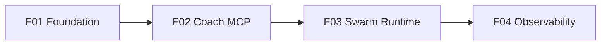

# features/

Phase-organized feature specs. Each markdown file = one feature, status
tracked inline. Regenerate dependency graph via `tech-lead:features-graph`.

## PHASE-1 — Foundation + first showcase

| ID | Feature | Status | Depends |
|---|---|---|---|
| [F01](PHASE-1/F01-foundation.md) | Foundation | in-progress | — |
| [F02](PHASE-1/F02-coach-integration.md) | Coach MCP Integration | in-progress | F01 |
| [F03](PHASE-1/F03-swarm-runtime.md) | Swarm Runtime | in-progress | F02 |
| [F04](PHASE-1/F04-observability.md) | Observability | pending | F03 |

## Dependency graph

## Future phases

- **PHASE-2** — VEX UI surface (canvas, preview, capture)
- **PHASE-3** — Cross-trio integration (ionq agent runs, helios CAS fork-eval)
- **PHASE-4** — Public demos + recorded walkthroughs
